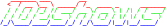

Welcome to the 102shows documentation!
======================================

.. note::
   This documentation is still being built!

   .. todo::
      #. Write module summaries
      #. include links to:
          #. tinue APA102 driver
          #. required python libs

.. toctree::
   :maxdepth: 2
   :caption: Contents:

   1-usage
   2-supported
   3-developing
   4-reference

Indices and tables
==================

* :ref:`genindex`
* :ref:`modindex`
* :ref:`search`

Trouble?
========

Open an `issue <https://github.com/Yottabits/102shows/issues>`_
on `GitHub <https://github.com/Yottabits/102shows/issues>`_
or write an email to me: 102shows@leiner.me
